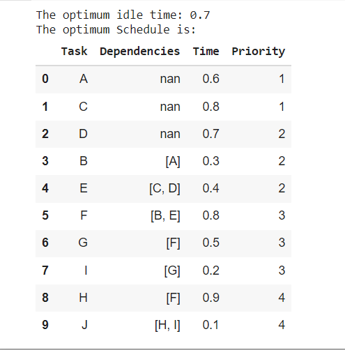
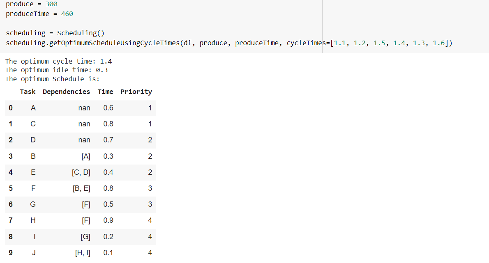

# Scheduling Algorithm

### Sample Input: **sampleScheduling.xlsx**

### Required Library : **numpy** , **pandas**

### Class: **Scheduling**

## In **Scheduling** class:

- Method **getOptimumSchedule** have 5 parameters. Where _cycleTime_ and _minWorkStation_ are optional.\
  Example:

  - produce = 300\
    produceTime = 460\
    scheduling = Scheduling()\
    scheduling.getOptimumSchedule(df, produce, produceTime)

  Output:\
  

---

- Method **getOptimumScheduleUsingCycleTimes** have also 5 parameters. Where _minWorkStation_ is optional.\
   When calling the **getOptimumScheduleUsingCycleTimes** method, a _cycleTimes_ list will have to provide. The algorithm will pick the best cycleTime and return the optimum schedule according to the picked cycleTime.\

  Example:

  - produce = 300\
    produceTime = 460\
    scheduling = Scheduling()\
    scheduling.getOptimumScheduleUsingCycleTimes(df, produce, produceTime, cycleTimes=[1.1, 1.2, 1.5, 1.4, 1.3, 1.6]))

  Output:\
  

---

- Method **sampleInputFormat** will return a sample input.

---
